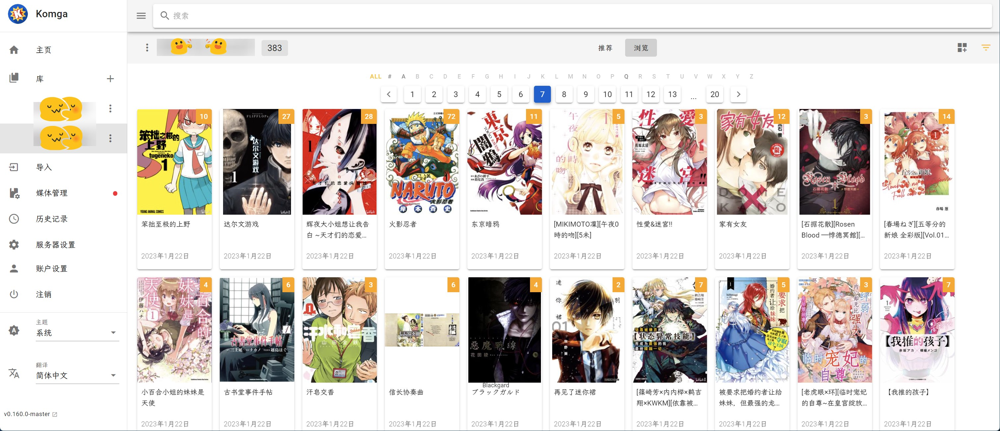
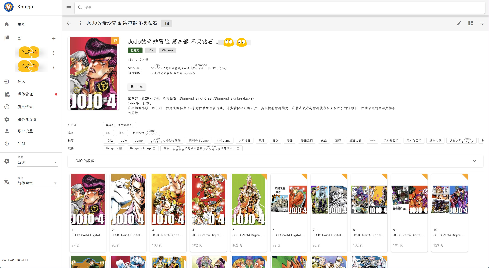

# Bangumi metadata scraper for Komga

- [Bangumi metadata scraper for Komga](#bangumi-metadata-scraper-for-komga)
  - [Introduction](#introduction)
  - [Features](#features)
    - [已完成](#已完成)
    - [TODO](#todo)
  - [Requirements](#requirements)
  - [快速开始](#快速开始)
  - [消息通知（可选）](#消息通知可选)
  - [创建失败收藏（可选）](#创建失败收藏可选)
  - [其他配置说明](#其他配置说明)
  - [如何修正错误元数据](#如何修正错误元数据)
  - [为小说添加元数据](#为小说添加元数据)
  - [同步阅读进度](#同步阅读进度)
  - [命名建议](#命名建议)
  - [Issues \& Pull Requests](#issues--pull-requests)
  - [致谢](#致谢)

## Introduction

This Script gets a list of every manga available on your Komga instance,
looks it up one after another on [Bangumi](https://bgm.tv/) and gets the metadata for the specific series.
This metadata then gets converted to be compatible to Komga and then gets sent to the server instance and added to the manga entry.




## Features

### 已完成

- [x] 为失败的系列创建收藏（可选）
- [x] 通知执行结果（可选）
- [x] 漫画系列添加元数据
- [x] 单册漫画添加元数据
- [x] 自动跳过已刷新元数据的条目
- [x] 优先使用手动配置的bangumi链接(cbl)
- [x] 配置Bangumi登录
- [x] 同步观看进度至Bangumi
- [x] 可选择处理范围：①所有书籍系列；②指定库的书籍系列；③指定收藏的书籍系列
- [x] ~~区分单册和单话~~👉未匹配的书也会重新排序
- [x] ~~添加同人志~~👉推荐使用[LANraragi](https://github.com/Difegue/LANraragi)
- [x] 可使用 Bangumi 图片替换系列、单册封面

处理逻辑见[DESIGN](docs/DESIGN.md)

### TODO

- [ ] 使用[bangumi/Archive](https://github.com/bangumi/Archive)离线数据代替联网查询
- [ ] 限制联网查询频率
- [ ] 提高 Bangumi 搜索结果匹配准确率，如：排序、评分
- [ ] 更新 Komga 封面时，判断：类型（'GENERATED'）、大小
- [ ] 重构元数据更新范围及覆盖逻辑


## Requirements

- A Komga instance with access to the admin account
- Either Windows/Linux/MAc or alternatively Docker
- Python installed if using Windows, Linux or Mac natively

## 快速开始

**Warning:**

Executing this program will result in the loss of old metadata for series and books

执行此程序将导致书籍系列及单册的旧元数据丢失


1. Install the requirements using
    ```shell
    # prepare the environment on your own
    conda install --file env_conda.txt
    pip install -r env_pip.txt

    # or use docker compose
    version: '3'
    services:
    bangumikomga:
        image: chu1shen/bangumikomga:main
        container_name: bangumikomga
        volumes:
        - /path/BangumiKomga/config.py:/app/config/config.py   # see step.2
        - /path/BangumiKomga/recordsRefreshed.db:/app/recordsRefreshed.db
        - /path/BangumiKomga/refreshMetadata.log:/app/refreshMetadata.log
    ```
2. Rename `config/config.template.py` to `config/config.py` and edit the url, email and password to match the ones of your komga instance (User needs to have permission to edit the metadata).

    `BANGUMI_ACCESS_TOKEN` （可选）用于读取NSFW条目，在 https://next.bgm.tv/demo/access-token 创建个人令牌

    `KOMGA_LIBRARY_LIST` 处理指定库中的书籍系列。komga界面点击库（对应链接）即可获得，形如：`'0B79XX3NP97K9'`，对应地址：`http://IP:PORT/libraries/0B79XX3NP97K9/series`。填写时以英文引号`''`包裹，英文逗号`,`分割。与`KOMGA_COLLECTION_LIST`不能同时使用

    `KOMGA_COLLECTION_LIST` 处理指定收藏中的书籍系列。komga界面点击收藏（对应链接）即可获得，形如：`'0B79XX3NP97K9'`。填写时以英文引号`''`包裹，英文逗号`,`分割。与`KOMGA_LIBRARY_LIST`不能同时使用

        Tips: 可以搭配`同步阅读进度`实现仅同步部分书籍系列的进度
    

3. Run the script using `python refreshMetadata.py`

**Tips:**

如果漫画系列数量上千，请考虑使用[bangumi/Archive](https://github.com/bangumi/Archive)离线数据代替联网查询

## 消息通知（可选）

消息通知支持[Gotify](https://github.com/gotify/server)、Webhook（如：[飞书](https://open.feishu.cn/document/client-docs/bot-v3/add-custom-bot)）、[Healthchecks](https://github.com/healthchecks/healthchecks)（定时任务监控）

- `NOTIF_TYPE_ENABLE`: 启用的消息通知类型

- Gotify
    - `NOTIF_GOTIFY_ENDPOINT`: Gotify base URL
    - `NOTIF_GOTIFY_TOKEN`: Application token

- Webhook
    - `NOTIF_WEBHOOK_ENDPOINT`: URL of the HTTP request. 如飞书中创建自定义机器人时的 webhook 地址

- Healthchecks
    - `NOTIF_HEALTHCHECKS_ENDPOINT`: URL of the HTTP request


## 创建失败收藏（可选）

将`CREATE_FAILED_COLLECTION`配置为`True`，程序会在刷新完成后，将所有刷新失败的系列添加到指定收藏（默认名：`FAILED_COLLECTION`）。

每次运行都会根据**本次**运行数据重新创建此收藏（无失败则跳过）。

**Tips:**

- 在此收藏中按照[如何修正错误元数据](#如何修正错误元数据)操作，启用`RECHECK_FAILED_SERIES`，然后填入`cbl`~~治疗强迫症~~

- 如果要将所有失败的系列都添加至收藏，则需要将`RECHECK_FAILED_SERIES`配置为`True`

## 其他配置说明

- `RECHECK_FAILED_SERIES`: 重新检查刷新元数据失败的系列
    - 建议搭配`cbl`使用
    - 其他情况下建议设置为`False`，可缩短程序运行时间

- `RECHECK_FAILED_BOOKS`: 重新检查刷新元数据失败的书
    - ~~意义不明的参数~~，建议设置为`False`，可缩短程序运行时间
    - 如果刷新书时，bangumi 数据不完整，则可以在数据补充后使用此参数修正此书元数据

- `USE_BANGUMI_THUMBNAIL`: 设置为`True`且未曾上传过系列海报时，使用 Bangumi 封面替换系列海报
    - 旧海报为 Komga 生成的缩略图，因此还可以通过调整`Komga 服务器设置->缩略图尺寸（默认 300px，超大 1200px）`来获得更清晰的封面
    - `USE_BANGUMI_THUMBNAIL_FOR_BOOK`: 设置为`True`且未曾上传过单册海报时，使用 Bangumi 封面替换单册海报

## 如何修正错误元数据

人工修正错误元数据可以使用`cbl(Correct Bangumi Link)`，只需在系列元数据的链接中填入`cbl`和该漫画系列的 bangumi 地址。此链接将在匹配时最先使用。

下面分三种情况说明具体操作：

- 自此系列添加至 komga 后还未运行过此程序：
    - 填入上面提到的信息
    - 正常执行`python refreshMetadata.py`

- 系列元数据更新失败，即「标题」与「排序标题」**一样**：
    - 填入上面提到的信息
    - 将`RECHECK_FAILED_SERIES`配置为`True`，重新匹配失败的系列
    - 正常执行`python refreshMetadata.py`

- 系列元数据更新错误，即匹配错误：
    - 填入上面提到的信息
    - 将此系列的 id 添加到`FORCE_REFRESH_LIST`，强制刷新此系列所有元数据。id 可在 komga 界面点击书籍系列（对应链接）获得，形如：`'0B79XX3NP97K9'`。填写时以英文引号`''`包裹，英文逗号`,`分割。
    - 正常执行`python refreshMetadata.py`


## 为小说添加元数据

Komga 并没有区分漫画与小说。

可以尝试修改代码，使其**只应用**于 Komga 的**小说库**：将`bangumiApi.py`中的`manga_metadata["platform"] != "小说"`修改为`manga_metadata["platform"] == "小说"`


## 同步阅读进度

_注意：当前仅为komga至bangumi单向同步_

**Tips:**

推荐使用Tachiyomi更新阅读进度👉[Tracking | Tachiyomi](https://tachiyomi.org/help/guides/tracking/#what-is-tracking)

**同步内容：**
- 仅同步卷数，不同步话数

1. 步骤同`刷新元数据`
2. 步骤同`刷新元数据`

    注意：
    - 如果配置了`FORCE_REFRESH_LIST`，则仅同步此列表配置的漫画系列进度
    - 如果未配置`FORCE_REFRESH_LIST`，则同步当前获取的**所有系列**的漫画进度（当前有3种范围：所有、仅指定库、仅指定收藏）。**为避免污染时间线，请谨慎操作**
3. `python updateReadProgress.py`

## 命名建议

`[漫画名称][作者][出版社][卷数][其他1][其他2]`


- [漫画名称]：以漫画封面实际名称为准，繁体不必转简体。
- [作者]：作者名字亦以单行本所给名字为准
    - 繁体不转为简体，若有日文假名亦保留，如[島崎讓]、[天王寺きつね]；
    - 若作者为多人，则以`×`或`&`符号连接各作者（**注意：不是英文`x`**），将作画作者列于最后，如[矢立肇×有贺ヒトシ]、[手塚治虫×浦沢直树]、[堀田由美×小畑健]。

- [出版社]：例如[玉皇朝]、[青文]。
- [卷数]：例如[Vol.01-Vol.12]。
- [其他1]、[其他2]：其他信息。例如[完结]、[来源]。

例如：

```
[碧蓝之海][井上堅二×吉岡公威][Vol.01-Vol.18]
[相合之物][浅野伦][Vol.01-Vol.13]
[海王但丁][皆川亮二×泉福朗][Vol.01-Vol.13][境外版]
```

_命名建议修改自某喵_

## Issues & Pull Requests

欢迎提交新规则、问题、功能……

## 致谢

本项目部分代码及思路来自[Pfuenzle/AnisearchKomga](https://github.com/Pfuenzle/AnisearchKomga)，部分代码生成自[chatgpt](https://chat.openai.com/)，在此表示感谢！


语料库数据来源，感谢公开：
- `bangumi_person.txt`文件提取自[bangumi/Archive](https://github.com/bangumi/Archive)
- `Japanese_Names_Corpus（18W）.txt`文件来自[wainshine/Chinese-Names-Corpus](https://github.com/wainshine/Chinese-Names-Corpus)


另外，也感谢以下优秀项目：
- [gotson/komga](https://github.com/gotson/komga)
- [bangumi/api](https://github.com/bangumi/api)
